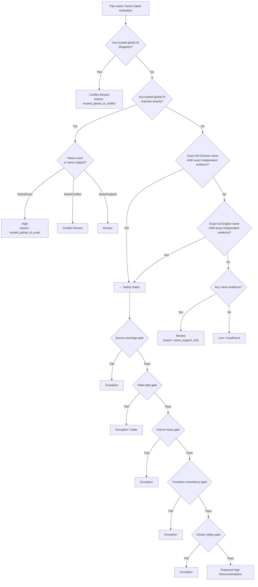
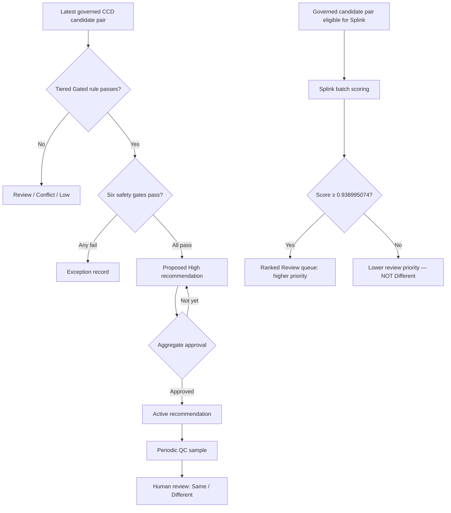
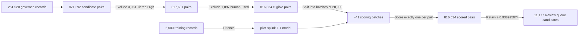
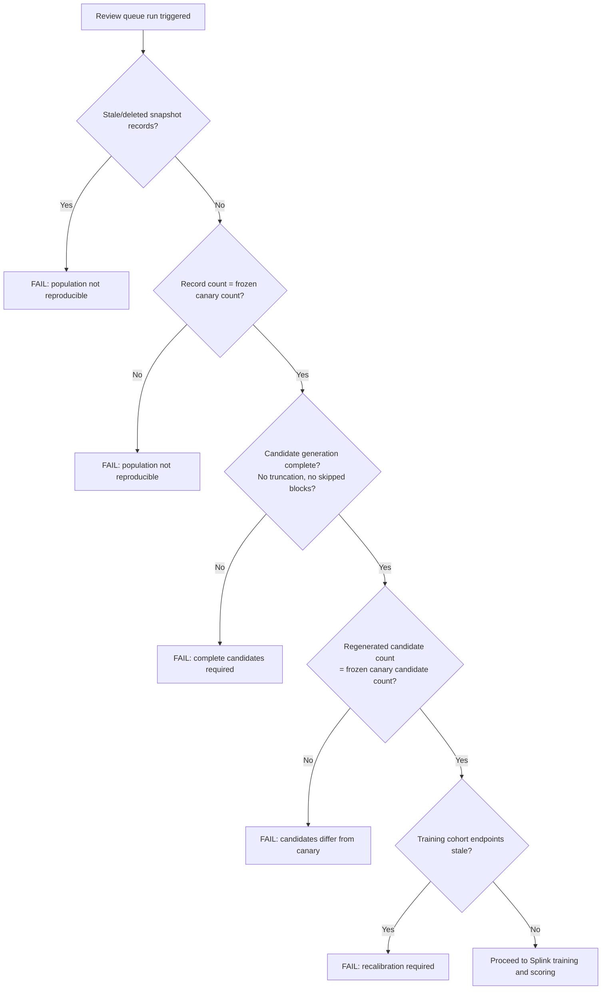
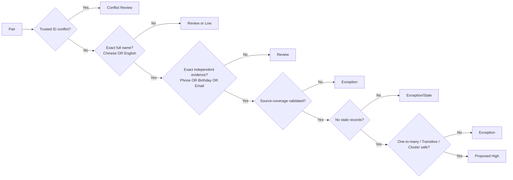

# CCD Tiered Evidence and Splink Technical Guide

**Status:** Management-approved post-POC operating baseline (2026-08-19)
**Policy version:** `pilot-1.6`
**Splink adapter:** `pilot-splink-1.1`
**Snapshot-specific Review cutoff:** `0.938995074`

---

## Table of Contents

1. [Executive Summary and Approved Operating Decisions](#1-executive-summary-and-approved-operating-decisions)
2. [Scope and Non-Goals](#2-scope-and-non-goals)
3. [Governed Sources and Identifier Scope](#3-governed-sources-and-identifier-scope)
4. [Reliability Status Limitation](#4-reliability-status-limitation)
5. [Normalization Rules](#5-normalization-rules)
6. [Evidence Levels and Cutoffs](#6-evidence-levels-and-cutoffs)
7. [Tiered Gated Decision Tree](#7-tiered-gated-decision-tree)
8. [Reason Codes](#8-reason-codes)
9. [Safety Gates](#9-safety-gates)
10. [Blocking Routes](#10-blocking-routes)
11. [Splink: Fellegi–Sunter Principles](#11-splink-fellegi-sunter-principles)
12. [m and u Probabilities](#12-m-and-u-probabilities)
13. [Term Frequency Adjustment](#13-term-frequency-adjustment)
14. [Training Cohort: 5,000-Record Bounded Design](#14-training-cohort-5000-record-bounded-design)
15. [Calibration vs. Training](#15-calibration-vs-training)
16. [Held-Out Validation](#16-held-out-validation)
17. [Review Queue: 20,000-Pair Batch Scoring](#17-review-queue-20000-pair-batch-scoring)
18. [Opaque Pair Sequences and Distinct 5,000 Limits / Chunks](#18-opaque-pair-sequences-and-distinct-5000-limits--chunks)
19. [Snapshot Reproducibility and Fail-Closed Safeguards](#19-snapshot-reproducibility-and-fail-closed-safeguards)
20. [Pair Safety vs. Cluster Safety](#20-pair-safety-vs-cluster-safety)
21. [Review Workflow](#21-review-workflow)
22. [Approved vs. Not-Approved Summary Table](#22-approved-vs-not-approved-summary-table)
23. [Snapshot-Specific POC Examples (Sanitized)](#23-snapshot-specific-poc-examples-sanitized)
24. [Audit and Research Methods (Temporarily Set Aside)](#24-audit-and-research-methods-temporarily-set-aside)
25. [Recalibration Triggers](#25-recalibration-triggers)
26. [Wilson 95% Confidence Interval](#26-wilson-95-confidence-interval)
27. [Glossary](#27-glossary)
28. [Architecture Diagrams](#28-architecture-diagrams)

---

## 1. Executive Summary and Approved Operating Decisions

Management approved the following operating decisions on **2026-08-19** after reviewing POC results and a live demonstration.

### 1.1 Tiered Gated is the approved deterministic recommendation method

The approved High path requires **all** of the following:

| Requirement | Detail |
|---|---|
| Exact full Chinese **or** English name | Both surname and given name must match exactly after normalization |
| Exact independent evidence | Phone, birthday, **or** email — at least one must match exactly |
| No trusted-identifier conflict | No non-empty trusted global identifier (e.g., valid full HKID) may disagree between the two records |

Passing pairs then proceed through six safety gates in order:

1. **Source-coverage gate** — the source-pair group must be represented in the approved validation cohort
2. **Stale-data gate** — neither record in the pair may have been modified after the frozen snapshot was captured
3. **One-to-many gate** — a record appearing in multiple High pairs within a cluster does not receive automatic recommendation
4. **Transitive-consistency gate** — all High edges in a connected component must form a coherent cluster
5. **Cluster-safety gate** — the full component is checked for internal `Different` labels or conflicts
6. **Data-quality gate** — normalized phone, email, and birthday must pass format validation before becoming evidence

### 1.2 Passing pairs become reversible recommendations only

Pairs that clear all gates are emitted as **`Proposed`** recommendation records. They do **not**:

- merge CCD Master records;
- set `Is Matched?` in the production Matching Score table;
- modify any existing match flag;
- become active without a separate aggregate-approval step in ERPNext.

The recommendation status lifecycle is:

```
Proposed → (aggregate approval) → Active
         → (reversal)           → Reversed
         → (gate failure)       → Exception
         → (stale-record check) → Stale
```

### 1.3 Splink is approved only to prioritize optional human review

Splink scores at or above the approved maximum-F1 cutoff are entered into a **ranked human-review queue**. This is an optional, capacity-based pool — not a mandatory backlog.

- A score **at or above** the cutoff means: higher priority for voluntary human review.
- A score **below** the cutoff means: lower review priority. It does **not** mean `Different`.
- No Splink probability threshold qualifies as an automatic High decision.

**Current snapshot-specific cutoff: `0.938995074`**

This value is specific to the current policy snapshot, `pilot-splink-1.1`, the current 5,000-record training cohort, the current comparison definitions, and the current calibration labels. See [Section 25](#25-recalibration-triggers) for when it must change.

---

## 2. Scope and Non-Goals

### Included in this guide

- Approved deterministic High path and all six safety gates
- Splink Review queue design, scoring limits, and fail-closed safeguards
- Source mappings, identifier scope, and Reliability Status limitation
- Normalization rules, evidence levels, blocking routes
- Splink Fellegi–Sunter principles, m/u probabilities, and term frequency
- 5,000-record training cohort rationale and constraints
- Calibration vs. training distinction
- Held-out validation methodology
- 20,000-pair batch scoring architecture
- Opaque pair sequences and distinct 5,000 insert chunks
- Snapshot reproducibility checks and fail-closed gates
- Pair-level vs. cluster-level safety
- Human review workflow and role separation
- Approved vs. not-approved decision table
- Sanitized snapshot-specific POC examples
- Recalibration triggers for the snapshot-specific cutoff

### Not in this guide

- Record merging or deletion
- Automatic `Is Matched?` updates
- Recall estimates from the High-only validation cohort
- A validated probabilistic High threshold
- HKID-only High path (unrepresented in the 100-pair validation sample)

---

## 3. Governed Sources and Identifier Scope

The pilot governs exactly **10 registered CCD source systems** (referred to as sources S-01 through S-10 in sanitized form). Every source has a versioned `SourceProfile` stored in the policy document.

### 3.1 SourceProfile structure

```python
@dataclass(frozen=True)
class SourceProfile:
    source: str
    field_map: dict[str, str]           # attribute → raw field name
    identifier_scope: dict[str, str]    # attribute → "global" | "local" | "unknown"
    disabled_attributes: frozenset[str] # attributes not applicable to this source
```

### 3.2 Attribute aliases

The policy resolves canonical attribute names through configurable alias lists:

| Canonical attribute | Typical raw field names |
|---|---|
| `chi_surname` | `chi_surname` |
| `chi_firstname` | `chi_firstname` |
| `eng_surname` | `eng_surname` |
| `eng_firstname` | `eng_firstname` |
| `phone` | `phone_num`, `res_phone`, `phone` |
| `email` | `email`, `contact_email` |
| `birthday` | `birthday`, `dob` |
| `hksr_num` | `hksr_num` |
| `hkid` | `hkid`, `hkid_num` |

### 3.3 Identifier scope and trusted global identifiers

An identifier becomes a **trusted global identifier** (a same-person anchor) only when:

1. The policy document lists its canonical attribute in `trusted_global_identifiers`; **and**
2. Both source profiles mark that attribute's scope as `"global"`.

The default scope for any attribute not explicitly configured is `"unknown"`, which is treated as local. A source-specific staff number or client ID uses `"local"` scope and never becomes a cross-source identity anchor.

**HKID special rule:** A valid HKID requires a full, unmasked value that passes check-digit verification. Partial, masked, or check-digit-invalid HKIDs are downgraded to `unverified_id` scope and cannot be trusted global evidence.

```text
Globally comparable  = (attribute ∈ trusted_global_identifiers)
                       AND (left source scope = "global")
                       AND (right source scope = "global")
                       AND (for HKID: valid_hkid(raw_value) = True)
```

---

## 4. Reliability Status Limitation

CCD Master records carry a `reliability_status` field, but the pilot does not use it as a gate on evidence quality. The field was found to be:

- inconsistently populated across source systems;
- not updated when underlying data changes;
- absent from several governed sources.

Using `reliability_status` as evidence or as a gate would silently suppress valid pairs from sources that do not populate the field, and would give false confidence for sources that set it optimistically.

The approved control is the **stale-data gate** (Section 9.2): a snapshot-time comparison detects any record modified after the frozen canary was taken, regardless of the reliability field.

---

## 5. Normalization Rules

All field values pass through normalization before any comparison or blocking-key computation.

| Attribute | Normalization applied |
|---|---|
| Chinese name | CJK normalization, traditional/simplified unification, whitespace stripped, invisible characters removed |
| English name | Lowercase, accents removed, non-alphabetic stripped, whitespace collapsed |
| Phone | Digits only, country code stripped if present, leading zeros normalized; **placeholder values removed** (sequential digit strings, all-same digits, non-eight-digit values) |
| Email | Lowercase, whitespace stripped |
| Birthday | ISO-8601 `YYYY-MM-DD` after parsing common locale formats |
| HKID | Uppercase, spaces removed, check digit verified; invalid result is null |
| Other identifiers | Uppercase, whitespace stripped, dashes removed |

Normalization produces `None` (SQL null) for missing or invalid values. A null value means **no evidence**; it is never treated as disagreement. An empty string is treated as null.

The phone normalization specifically removes:
- strings of all identical digits (e.g., `11111111`);
- strings that are fully sequential ascending or descending (e.g., `12345678`);
- strings shorter than 8 digits after cleaning;
- strings containing only non-digit characters.

These are treated as placeholder values that carry no identity information.

---

## 6. Evidence Levels and Cutoffs

Each attribute comparison produces an `Evidence` object with a level from the following ordered enum:

```python
class EvidenceLevel(str, Enum):
    MISSING   = "missing"   # one or both sides null after normalization
    DISAGREE  = "disagree"  # both present, do not agree
    WEAK      = "weak"      # some similarity but below thresholds
    CLOSE     = "close"     # substantial similarity, not exact
    PHONETIC  = "phonetic"  # phonetically equivalent
    EXACT     = "exact"     # string equality after normalization
```

Only `EXACT` satisfies the High-path independent-evidence requirement. `CLOSE`, `PHONETIC`, and `WEAK` contribute to Review routing but never satisfy the High path.

`MISSING` on either side means the field provides no information; it is not counted as `DISAGREE`.

### Evidence object properties

```python
@dataclass(frozen=True)
class Evidence:
    attribute: str
    level: EvidenceLevel
    score: float              # 0.0–1.0 continuous similarity
    left_present: bool
    right_present: bool
    reason: str               # human-readable comparison explanation

    @property
    def available(self) -> bool:
        return self.left_present and self.right_present

    @property
    def exact(self) -> bool:
        return self.level == EvidenceLevel.EXACT
```

---

## 7. Tiered Gated Decision Tree

The approved deterministic decision tree uses the **gated** conflict mode.



Key rules in the gated mode:

- **Any** non-empty trusted-identifier disagreement blocks the pair at `Conflict Review`. There is no recovery path in the approved operating mode.
- **No** comparison of name fields alone (even exact exact names) is sufficient for High. A second independent evidence type is always required.
- Independent evidence types are: `birthday`, `phone`, `email`. At least one must be `EXACT`.

---

## 8. Reason Codes

Reason codes are stored on every recommendation and evaluation record. They explain the primary evidence that triggered the decision.

| Reason code | Meaning |
|---|---|
| `trusted_global_id_exact:hkid` | Both sides have matching valid HKID with global scope |
| `trusted_global_id_exact:hksr_num` | Both sides have matching HKSR number with global scope |
| `trusted_global_id_conflict:hkid` | Non-empty valid HKIDs disagree |
| `trusted_global_id_conflict:hksr_num` | Non-empty HKSR numbers disagree |
| `chinese_full_name_exact` | Normalized Chinese surname + given name match exactly |
| `english_full_name_exact` | Normalized English surname + given name match exactly |
| `independent_exact:birthday` | Normalized birthdays match exactly |
| `independent_exact:phone` | Normalized phone numbers match exactly |
| `independent_exact:email` | Normalized email addresses match exactly |
| `unverified_identifier_exact:hkid` | HKIDs match but are not in global scope (audit use only) |
| `unverified_identifier_exact:hksr_num` | HKSR numbers match but not in global scope (audit use only) |
| `name_support_only` | Name evidence present but insufficient for High |
| `source_coverage_exception` | Source-pair group not represented in validated cohort |
| `stale_data_exception` | One or more records modified after frozen snapshot |
| `one_to_many_source_conflict` | Record appears in multiple conflicting High edges |
| `transitive_inconsistency` | High edges in a component contradict each other |
| `cluster_safety_exception` | Component contains confirmed `Different` labels or conflicts |

---

## 9. Safety Gates

Safety gates are evaluated **after** the deterministic High rule is satisfied and **before** a `Proposed` recommendation is created. Every gate fails closed: a gate failure produces an `Exception` record rather than a recommendation.

### 9.1 Source-coverage gate

The pair's source combination (left source × right source) must appear in the approved High-validation cohort. Source-pair groups not represented in the 100-pair targeted validation sample remain exception-only until a separate validation is completed.

At the time of the current canary preview:

```text
Governed source-pair groups:         All validated except three sparse groups
Sparse unvalidated groups:           3 (17 historical High candidates total)
Those 3 groups in current preview:   0 High candidates → 0 source-coverage exceptions
```

### 9.2 Stale-data gate

After the canary snapshot is captured, any CCD Master record that is subsequently modified (any field change, including administrative updates) is considered **stale**. Stale records produce an `Exception` rather than a `Proposed` recommendation.

The stale check compares the `source_modified` timestamp captured in the evaluation snapshot against the live `modified` value in CCD Master:

```python
def _stale_record_ids(record_by_id, record_ids):
    # Re-fetch live modified timestamps from CCD Master
    # Compare against snapshot-time source_modified
    return {id for id in record_ids
            if current_modified[id] != snapshot_modified[id]}
```

### 9.3 One-to-many gate

A single CCD Master record must not appear in multiple High-tier edges pointing to different counterparts. If record A is High with both B and C, the system cannot safely recommend all three are the same person without additional evidence. The entire affected component becomes an `Exception` with reason `one_to_many_source_conflict`.

The current exception count is **433 exception edges across 191 connected-component cases** — all with reason `one_to_many_source_conflict`.

### 9.4 Transitive-consistency gate

Within a connected component of High edges, every implied identity relationship must be consistent. If A–B is High and B–C is High, then A–C must also be consistent. Internal contradictions fail the whole component.

### 9.5 Cluster-safety gate

A component that contains any confirmed `Different` human label for any pair within it fails this gate. Human-confirmed differences prevent automatic recommendation of any edge in the affected cluster.

### 9.6 Data-quality gate

Phone, email, and birthday values are normalized before becoming evidence. A value that fails normalization (e.g., a sequential placeholder phone number) produces a `MISSING` evidence level rather than a usable `EXACT` comparison. This gate is applied inline during normalization rather than as a separate gate step.

---

## 10. Blocking Routes

Candidate pairs are generated through **blocking**: records sharing a common blocking key are candidates for comparison. Without blocking, comparing all 251,520 × 251,520 records would produce billions of comparisons.

### 10.1 Route priority order

```python
BLOCK_ROUTE_PRIORITY = {
    "global_id":         0,   # highest priority
    "phone":             1,
    "email":             1,
    "unverified_id":     2,
    "dob_surname":       3,
    "chi_full":          4,
    "chi_pinyin_full":   5,
    "chi_given_sorted":  5,
    "eng_name":          6,
    "chi_name_prefix":   7,   # lowest priority (broadest)
}
```

Routes with lower numbers are added to the candidate pool first. The candidate pool is capped at `max_candidate_pairs = 500,000` per policy document.

### 10.2 Route descriptions

| Route | Blocking key pattern | Purpose |
|---|---|---|
| `global_id` | `global_id:{attribute}:{value}` | Exact match on trusted, globally-scoped identifier |
| `phone` | `phone:{normalized_phone}` | Exact 8-digit phone after normalization |
| `email` | `email:{normalized_email}` | Exact email after normalization |
| `unverified_id` | `unverified_id:{attribute}:{value}` | Partial/local/unverified ID; for audit only |
| `dob_surname` | `dob_surname:{date}:{surname}` | Birthday combined with Chinese or English surname |
| `chi_full` | `chi_full:{surname}{given}` | Full concatenated Chinese name (exact) |
| `chi_pinyin_full` | `chi_pinyin_full:{surname}:{given_pinyin}` | Chinese surname + Pinyin of given name (covers homophones) |
| `chi_given_sorted` | `chi_given_sorted:{surname}:{sorted_chars}` | Chinese surname + sorted given-name characters (covers transpositions) |
| `eng_name` | `eng_name:{surname}:{given[:2]}` | English surname + first two characters of given name |
| `chi_name_prefix` | `chi_name_prefix:{surname}:{given[:1]}` | Chinese surname + first character of given name (broadest) |

### 10.3 Oversized block skipping

Any blocking key that would produce a block larger than `max_block_size = 10,000` records is skipped. Skipped blocks are recorded by route and an anonymized hash of the key. The Splink Review queue requires **zero skipped blocks** and fails closed if any appear.

### 10.4 Broad-route pair selection

For `chi_name_prefix` and `eng_name` routes, the blocking step does not generate all combinations within a block. Instead, each record nominates its **closest-name counterpart per other source**, and nominations are ranked from the sparsest endpoints first. This prevents large integrated sources from consuming the entire candidate budget before sparse sources receive any candidates.

---

## 11. Splink: Fellegi–Sunter Principles

Splink implements the **Fellegi–Sunter** probabilistic record linkage framework. The framework assigns a match probability to each candidate pair by comparing the likelihood that the observed field agreements and disagreements would occur if the two records represent the same person (match hypothesis M) vs. different people (non-match hypothesis U).

### 11.1 Match probability formula

For a pair with comparison observations `γ₁, γ₂, …, γₙ` across n comparison columns:

```
P(Match | γ₁…γₙ) = λ × ∏ m(γᵢ) / u(γᵢ)
                   ─────────────────────────
                   λ × ∏ m(γᵢ)/u(γᵢ) + (1-λ) × 1
```

Where:

- `λ` is the prior probability that any given candidate pair is a match (the random-match prior);
- `m(γᵢ)` is the probability that comparison `γᵢ` is observed given the pair is a match;
- `u(γᵢ)` is the probability that comparison `γᵢ` is observed given the pair is not a match.

### 11.2 Prior (λ)

The adapter uses Splink's conservative default random-match prior of **`0.0001`** (1 in 10,000). It does not estimate the prior from exact-name blocks, because common CCD names can create an inflated prior that falsely elevates probabilities for pairs that share a common name.

### 11.3 Comparison columns

The Splink model uses the following comparison columns (derived from the same evidence attributes as the deterministic model):

| Comparison | Level hierarchy |
|---|---|
| Chinese full name | exact match / phonetically similar / first character match / else |
| English full name | exact match / similar / else |
| Phone | exact match / missing / else |
| Email | exact match / missing / else |
| Birthday | exact match / missing / else |
| HKID | exact match / missing / else |

Missing values are represented as SQL nulls (not empty strings). This ensures Splink does not learn null/null agreement as evidence of identity.

---

## 12. m and u Probabilities

**m probability:** the probability that two fields in a matching pair agree at a given comparison level.
**u probability:** the probability that two fields in a non-matching pair agree at a given comparison level by chance.

### 12.1 Expectation–Maximization (EM) estimation

Splink estimates m and u probabilities iteratively using EM. Starting from initial estimates:

1. **E-step:** Use the current m/u estimates to compute a match probability for every training-cohort pair.
2. **M-step:** Use those probabilities as weights to re-estimate the m/u values.
3. Repeat until convergence.

EM uses up to **250,000 randomly sampled pairs** within the training cohort to estimate u probabilities. The same limit applies to the pairs used in each EM iteration.

### 12.2 Interpretation

For a phone comparison:

| Scenario | m(exact) | u(exact) | Bayes factor |
|---|---|---|---|
| Typical pattern | ~0.90 | ~0.001 | ~900 |

A Bayes factor of 900 means: an exact phone match makes the pair 900 times more likely to be a genuine match than a chance agreement.

### 12.3 Model version and parameters are frozen

The current model is `pilot-splink-1.1`. Its m/u estimates, comparison definitions, and field configurations are frozen for the duration of the current approved Review queue operation. Changes to any of these require a new model version and recalibration.

---

## 13. Term Frequency Adjustment

Common names (such as `Chan` or `Lee`) are weaker identity evidence than rare names. Term-frequency (TF) adjustment reduces the match-probability contribution of a common-name agreement relative to a rare-name agreement.

Splink estimates term frequencies from the training-cohort population. For Chinese surname `陳` (Chan) which appears in many records:

```
TF adjustment for exact 陳 match: lower Bayes factor
TF adjustment for exact 蘭桂坊 match: higher Bayes factor
```

Term frequencies are estimated once during training on the 5,000-record cohort. They reflect the population of that cohort. If the cohort underrepresents certain names, their frequency estimates may be less reliable.

---

## 14. Training Cohort: 5,000-Record Bounded Design

### 14.1 Why 5,000 records

The ERPNext long worker has a fixed memory budget. Experiments confirmed that a 20,000-record training cohort with a 250,000-pair random-u sample exceeded the worker memory limit before scoring completed. The 20,000-record model was killed without producing any accuracy result.

```
5,000-record training:  Completed. Average precision 0.6242, ROC AUC 0.8714.
20,000-record training: Killed by memory limit. No accuracy result.
```

The 5,000-record limit is therefore a **hard operational constraint**, not an arbitrary choice.

### 14.2 What the 5,000 records contain

The training cohort is a **deterministic background sample** from the governed record population, supplemented by every record that appears as an endpoint in the retained human-review pairs. The selection is reproducible from the same frozen snapshot.

```python
MAX_SPLINK_TRAINING_RECORDS = 5_000
```

### 14.3 What the 5,000-record limit does and does not mean

| Statement | Correct? |
|---|---|
| Splink trains on 5,000 records | Yes |
| Splink can only score pairs involving those 5,000 records | No |
| The 5,000-record model can score pairs from the full 251,520-record population | Yes |
| The 5,000 records must represent all source systems | Aspirational; sparse sources may be underrepresented |

The 5,000 records are used to fit the model (estimate m, u, and term frequencies). The fitted model is then applied to pairs drawn from the **full** governed population.

---

## 15. Calibration vs. Training

These are distinct steps performed on different data:

| Step | Data used | Purpose |
|---|---|---|
| Training | 5,000-record background cohort | Estimate Splink m/u probabilities via EM |
| Calibration | Locked labeled evaluation pairs (calibration split) | Select an operating Review threshold |
| Validation | Locked labeled evaluation pairs (held-out split) | Estimate performance at the selected threshold |

The calibration labels are human-reviewed pairs with `Same`, `Different`, or `Unsure` outcomes. The calibration step selects the cutoff that maximizes F1 on the calibration split. The held-out split is never used during threshold selection.

**The current cutoff `0.938995074` was selected on the calibration split and confirmed on the held-out split of the `pilot-1.6` 500-pair representative recalibration.**

---

## 16. Held-Out Validation

### 16.1 Split design

The 500-pair labeled evaluation cohort is split into:

- **Calibration split** (~70%): threshold selection
- **Held-out split** (~30%): independent performance estimate

Pairs from earlier human reviews are excluded from both splits to prevent label leakage.

### 16.2 POC held-out results at the approved cutoff

| Metric | Value |
|---|---|
| Calibration precision | 44.92% |
| Calibration recall | 88.33% |
| Held-out precision | 44.62% |
| Held-out recall | 76.32% |
| Held-out F1 | Calculated at maximum-F1 cutoff |
| Confirmed Same pairs above cutoff (held-out) | 43/70 |
| Confirmed Same pairs below cutoff (held-out) | 27/70 |

The 27 confirmed Same pairs below the cutoff are not treated as `Different`. Their scores fall below the current Review-priority band; they are lower-priority, not excluded.

### 16.3 No valid automatic High threshold

The POC did not produce a Splink probability threshold that satisfies the automatic High precision target (Wilson 95% lower bound ≥ 95%). Splink remains a **review prioritization tool only**.

---

## 17. Review Queue: 20,000-Pair Batch Scoring

### 17.1 Architecture overview

The Review queue uses a **separate batch-scoring path** that does not share the old direct-scoring limit.

```
Training phase:
  5,000 training records → fit Splink model once

Scoring phase:
  251,520 governed records provide pair endpoints
  821,592 governed candidate pairs
  − 3,961 Tiered High pairs excluded
  − 1,097 previously human-used pairs excluded
  = 816,534 eligible pairs
  → scored in batches of 20,000 using DuckDB
  → 11,177 pairs at or above cutoff stored in Review queue
```

### 17.2 Why 20,000 pairs per batch

```python
REQUESTED_PAIR_BATCH_SIZE = 20_000
```

Each batch loads its pairs into temporary DuckDB tables, joins exactly on pair sequence, scores, and discards the temporary tables. This avoids loading all 816,534 pairs into memory simultaneously.

```
816,534 ÷ 20,000 ≈ 41 scoring batches
```

### 17.3 Not a Cartesian join

A naive implementation would join 20,000 left records against 20,000 right records, producing 400,000,000 comparisons. The batch scorer does not do this.

Each pair in a batch is assigned an **opaque sequence number** (see Section 18). The DuckDB join condition is:

```sql
LEFT.__pair_sequence = RIGHT.__pair_sequence
```

This produces **exactly one comparison per requested pair** — 20,000 comparisons for 20,000 pairs.

### 17.4 Integrity verification

After scoring each batch, the adapter verifies:

```
Number of output scores = number of requested pairs in batch
```

Any batch with missing or duplicate pair scores causes the entire queue run to fail rather than publishing a partial result.

---

## 18. Opaque Pair Sequences and Distinct 5,000 Limits / Chunks

### 18.1 Opaque pair sequences

Each requested pair is assigned a deterministic integer sequence number before batch loading. The sequence number is opaque — it does not encode the record IDs or any identity-relevant data. It serves only as a join key within a single batch.

```
Pair (A, B) → sequence 0
Pair (C, D) → sequence 1
Pair (E, F) → sequence 2
…
```

After batch scoring, sequence numbers are discarded. The output maps back to pair keys `(left_id, right_id)`.

### 18.2 Distinct 5,000 limits

There are three separate limits of 5,000 that must not be confused:

| Limit | Value | Meaning | Replaced by batch mode? |
|---|---|---|---|
| Training cohort size | 5,000 records | Maximum records used to fit the Splink model | No — still applies |
| Direct-scoring pair limit | 5,000 pairs | Maximum pairs scored via `compare_two_records()` one at a time | Yes, for the batch queue path |
| Database insert chunk | 5,000 rows | Number of queue rows written per database insert batch | No — this is an insert batch, not a queue cap |

```python
MAX_DIRECT_SCORING_PAIRS = 5_000   # still applies when batch_requested_pairs=False
REQUESTED_PAIR_BATCH_SIZE = 20_000 # scoring batch in the Review queue path
```

### 18.3 When direct scoring is still used

Direct scoring via `compare_two_records()` is still used when `batch_requested_pairs=False`. This applies to:

- bounded evaluation samples (≤ 500 pairs);
- repair runs for a small held-out validation set;
- any situation where the requested pairs were not generated through the governed batch pipeline.

The 5,000 direct-scoring limit protects against accidentally calling `compare_two_records()` hundreds of thousands of times through the old path.

---

## 19. Snapshot Reproducibility and Fail-Closed Safeguards

### 19.1 The frozen canary snapshot

The canary captures a frozen population at the time of its creation:

- `record_count`: exact number of governed CCD Master records in the snapshot
- `candidate_count`: exact number of governed candidate pairs
- `snapshot_at`: timestamp

A Splink Review queue created from that canary must reproduce the **entire** frozen snapshot, not only the 5,000-record training cohort.

### 19.2 Explicit fail-closed checks

The Review queue run includes the following explicit fail-closed checks:

```python
# Check 1: Stale or deleted snapshot records
if stale_snapshot_records or len(records) != int(canary.record_count or 0):
    frappe.throw(
        "The frozen canary record population is no longer reproducible"
    )

# Check 2: Candidate generation must be complete (no truncation, no skipped blocks)
if blocked.truncated or blocked.skipped_blocks:
    frappe.throw(
        "Splink Review queue requires complete candidate generation"
    )

# Check 3: Regenerated candidate count must match frozen canary
if len(blocked.pairs) != int(canary.candidate_count or 0):
    frappe.throw(
        "The regenerated candidates differ from the frozen canary"
    )

# Check 4: Stale training cohort
if stale_training:
    frappe.throw(
        "The approved Splink training cohort changed; recalibration is required"
    )
```

These checks are **code-level** fail-closed gates. They abort the queue run if any reproducibility condition is not met. There is no UI equivalent: the system refuses to produce a partial or inconsistent queue.

### 19.3 Why full snapshot reproducibility is required

The Review cutoff `0.938995074` was validated against the **specific frozen population** used in the canary. Scoring a different population (even if only a few records changed) with the same cutoff produces probabilities that cannot be compared against the validated threshold.

A queue created long after its canary must prove all of the following before it will run:

1. Every record in the canary snapshot still exists in CCD Master;
2. No record has been modified since the snapshot;
3. The reproduced candidate-pair count exactly matches the frozen count;
4. The 5,000-record training cohort endpoints are all still unmodified;
5. No candidate-generation block was truncated or skipped;
6. The same policy snapshot, Splink adapter, and cutoff are active.

---

## 20. Pair Safety vs. Cluster Safety

### 20.1 Pair-level safety

A pair passes pair-level safety when:

- the deterministic High rule is satisfied;
- neither record is stale;
- the source-pair group is covered.

This is necessary but not sufficient for a recommendation.

### 20.2 Cluster-level safety

Pairs are part of connected components (clusters) of High edges. Before any edge in a cluster becomes a `Proposed` recommendation, the **full cluster** must pass:

- **One-to-many check:** no record appears in multiple edges pointing to different counterparts
- **Transitive-consistency check:** all implied relationships are mutually consistent
- **Cluster-safety check:** no confirmed `Different` human label exists for any pair in the cluster

A single failing edge blocks the **entire component** from receiving recommendations.

### 20.3 Current exception statistics

```
Total High edges before gates:     3,528 Proposed + 433 Exception
Exception edges:                   433
Exception components:              191
Exception reason:                  All 433 = one_to_many_source_conflict
```

No exceptions due to source-coverage, stale-data, transitive, or cluster-safety failures in the current preview. All exception edges are currently in the one-to-many category.

---

## 21. Review Workflow

### 21.1 Deterministic High recommendations

```
1. Canary run generates Proposed recommendations
2. Each recommendation stores: model version, evidence reasons, snapshot time,
   source scope, status, and immutable reversal history
3. Periodic random QC sample (~100 pairs) is drawn from Proposed
4. QC reviewers confirm Same or Different independently
5. Aggregate approval step activates the full Proposed batch
6. Active recommendations are available for operational use
7. Exception queue presents 191 connected-component cases for human resolution
```

### 21.2 Splink Review queue

```
1. Queue generates 11,177 candidates ranked by Splink probability (descending)
2. Candidates are an optional, capacity-based pool
3. Reviewer assignment must be limited by operational capacity
4. Ordinary reviewers see masked values; no record IDs or Splink scores
5. Sensitive Reviewers / System Managers see full-value links
6. Individual probabilities are System Manager-only
7. Same requires two independent confirmations from different reviewers
8. Unsure and reviewer disagreements require adjudication
9. Human-confirmed Same pairs are stored separately from model High predictions
10. All reviewer decisions are immutable and auditable
```

### 21.3 Role separation

| Role | Sees |
|---|---|
| Ordinary reviewer | Masked field values; no record IDs, no model scores |
| Sensitive Reviewer | Full field values, record links |
| System Manager | All above plus individual Splink probabilities |

Ordinary reviewers do not see model tier labels or reason codes during the review phase. This prevents anchoring on the model's assessment.

---

## 22. Approved vs. Not-Approved Summary Table

| Capability | Approved? | Notes |
|---|---|---|
| Tiered Gated High recommendations | **Yes** | Reversible Proposed only; no automatic activation |
| Reversible recommendation records | **Yes** | `Proposed` → `Active` requires separate aggregate approval |
| Splink Review queue for human prioritization | **Yes** | Optional; capacity-based; no automatic decisions |
| Splink cutoff `0.938995074` for review priority | **Yes** | Snapshot-specific; must recalibrate on any material change |
| Record merging | **No** | Out of scope until canary reviewed |
| Automatic `Is Matched?` setting | **No** | Out of scope until canary reviewed |
| Probabilistic automatic High threshold | **No** | POC did not produce a validated threshold |
| HKID-only High path | **No** | Unrepresented in the 100-pair validation sample |
| Tiered Recoverable conflict path to High | **No** | POC method; temporarily set aside |
| Hybrid deterministic+probabilistic High | **No** | POC method; temporarily set aside |
| Legacy baseline formula as identity decision | **No** | Remains as control/current path only |
| 20,000-record Splink training | **No** | Exceeded worker memory limit; no accuracy result |

---

## 23. Snapshot-Specific POC Examples (Sanitized)

The following examples use synthetic data that does not correspond to any real CCD Master record or client. They illustrate how the approved decision tree behaves.

### 23.1 Example A — High via Chinese name + phone

```
Left record:   Chi name = 陳大文 | Phone = 91234567 | Source = S-01
Right record:  Chi name = 陳大文 | Phone = 91234567 | Source = S-04

Normalization:
  Chi name left/right:  陳大文 / 陳大文  → exact
  Phone left/right:     91234567 / 91234567  → exact

Evidence:
  chinese_full_name_exact   = True
  independent_exact:phone   = True
  trusted_global_id_conflict = None

Safety gates: source-coverage (S-01×S-04 validated), stale (no), one-to-many (no), transitive (N/A), cluster-safety (no prior Different)

Result: Proposed High
Reason codes: chinese_full_name_exact, independent_exact:phone
```

### 23.2 Example B — Conflict Review

```
Left record:  HKID = A123456(7) | Source = S-02 (scope = global)
Right record: HKID = B234567(8) | Source = S-03 (scope = global)

Normalization:
  Left HKID:  A1234567 → valid, global scope
  Right HKID: B2345678 → valid, global scope

Evidence:
  trusted_global_id_conflict:hkid = True

Result: Conflict Review (regardless of name or other evidence)
Reason codes: trusted_global_id_conflict:hkid
```

### 23.3 Example C — Review (name only)

```
Left record:   Chi name = 李小明 | Phone = 98765432 | Source = S-01
Right record:  Chi name = 李小明 | Phone = missing  | Source = S-05

Evidence:
  chinese_full_name_exact   = True
  independent_exact:phone   = False (right side missing)
  independent_exact:birthday = False (both missing)
  independent_exact:email    = False (both missing)

Result: Review
Reason codes: name_support_only
```

### 23.4 Example D — Stale exception

```
Canary snapshot captured: 2026-08-01 09:00:00
Left record modified:     2026-08-02 14:23:11  (after snapshot)

Stale gate: modified timestamp mismatch detected

Result: Exception
Reason code: stale_data_exception
```

### 23.5 Example E — Below Splink cutoff (lower priority, not Different)

```
Candidate pair: eligible for Splink scoring (not Tiered High, not human-used)
Splink score:   0.72

Cutoff: 0.938995074
0.72 < 0.938995074

Result: NOT stored in Review queue
Interpretation: Lower human-review priority
This pair is NOT labeled Different; it remains an unreviewed candidate
```

---

## 24. Audit and Research Methods (Temporarily Set Aside)

The following methods were evaluated during the POC as comparison baselines. They are **not** part of the approved operating path. They are retained in the codebase for audit, research, and potential future investigation.

### 24.1 Tiered Recoverable

The Recoverable variant allowed independent name and exact secondary evidence to recover a trusted-identifier conflict pair from `Conflict Review` to ordinary `Review` (never directly to `High`). This was evaluated to determine whether strong secondary evidence should override a possible data-entry error in an identifier.

**POC conclusion:** The approach is useful for routing some conflicts to ordinary Review rather than the dedicated Conflict Review queue. However, management approved the Gated approach for the current operating phase. Recoverable is not part of the approved High path.

### 24.2 Hybrid (Splink + Deterministic Gates)

The Hybrid approach applied deterministic identifier safety gates around a calibrated Splink score. It was intended to use a probabilistic threshold for High decisions after the deterministic gates passed.

**POC conclusion:** The POC did not produce a validated Splink probabilistic High threshold. Without a validated threshold, Hybrid cannot add automatic High decisions. It remains shadow/review-prioritization only.

### 24.3 Legacy Baseline Formula

The existing `fuzzymachingscript` weighted formula is retained as the control path. It evaluates each registration's current fuzzy logic in its own direction and reports the maximum directional score.

**POC conclusion:** The current flagged pairs from the baseline had low precision. The score is not a calibrated identity probability. No new automatic decisions are authorized from the baseline formula. It is retained as the current/control path for comparison purposes.

---

## 25. Recalibration Triggers

The snapshot-specific cutoff `0.938995074` is tied to a specific set of conditions. **Any** of the following changes requires recalibration before the cutoff can be used for a new Review queue:

| Change trigger | Reason |
|---|---|
| Splink adapter version changes | m/u estimates and comparison definitions may differ |
| Training cohort changes | Term frequencies and m/u estimates depend on the training population |
| Comparison field definitions change | Changing what constitutes "exact", "close", etc. changes all probabilities |
| Normalization rules change | Different normalization produces different comparison outcomes |
| Policy document changes | Source profiles, trusted identifiers, or aliases affect which fields are compared |
| Labeled calibration data significantly expands | Better labels may move the optimal F1 threshold |
| CCD Master population materially changes | New sources, data migration, or large import changes the candidate population |
| Canary snapshot changes | The frozen population for which the cutoff was validated has changed |

**Process for recalibration:**

1. Freeze a new training cohort with the same 5,000-record limit
2. Fit a new Splink model (assign a new adapter version, e.g., `pilot-splink-1.2`)
3. Score the locked labeled calibration pairs with the new model
4. Select the new maximum-F1 cutoff on the calibration split
5. Validate on the held-out split
6. Record the new cutoff, adapter version, and cohort snapshot
7. Submit for management approval before activating a new Review queue

The old cutoff `0.938995074` must not be reused with a new model version, even if the numeric value happens to seem similar.

---

## 26. Wilson 95% Confidence Interval

### 26.1 Origin

The Wilson score interval was introduced by **Edwin Bidwell Wilson** (1879–1964) in a 1927 paper titled *Probable Inference, the Law of Succession, and Statistical Inference*. It is a standard method for computing confidence intervals for proportions, particularly when the sample proportion is near 0% or 100%.

### 26.2 POC result

The targeted 100-pair High-only validation cohort produced:

```
Correct (Same) predictions:   100
Total predictions reviewed:   100
Observed precision:           100%

Wilson 95% lower bound:       96.30%
Wilson 95% upper bound:       100%
Policy precision target:      95%

96.30% > 95%  → acceptance criterion passed
```

### 26.3 Interpretation

The Wilson interval expresses sampling uncertainty. Even with 100/100 correct results, a sample of 100 does not prove that all future predictions will be correct. The lower bound of 96.30% is the conservative estimate: if the same sampling procedure were repeated many times, approximately 95% of the resulting intervals would contain the true precision.

### 26.4 Why Wilson is preferred over simple ±

A simple normal-approximation interval (`p ± 1.96 × √(p(1-p)/n)`) behaves poorly when `p = 1.0` (zero observed failures). It would produce an upper bound of exactly 100% and a lower bound that is mathematically undefined or zero. Wilson's method handles this case correctly.

### 26.5 Sample size effect

| Correct / sample | Approx. Wilson 95% lower bound |
|---:|---:|
| 10 / 10 | 72.25% |
| 30 / 30 | 88.65% |
| 50 / 50 | 92.86% |
| 73 / 73 | 95.00% |
| 100 / 100 | 96.30% |

The POC used 100 pairs specifically to ensure that a perfect result still exceeded the 95% policy target at the lower confidence bound.

### 26.6 What the interval measures

The Wilson interval estimates **precision** (of the sampled High predictions), not:

- recall (proportion of all true duplicates that were found);
- precision of Review predictions;
- precision of Splink probabilities;
- precision of the production baseline formula.

---

## 27. Glossary

| Term | Definition |
|---|---|
| **Tiered Gated** | The approved deterministic recommendation method; trusted-ID conflicts are gated to Conflict Review with no recovery path |
| **Tiered Recoverable** | POC comparison method; conflict recovery to Review via secondary evidence; temporarily set aside |
| **High** | A pair that passes the approved deterministic rule and all six safety gates; emitted as Proposed only |
| **Review** | A pair with useful but insufficient evidence for automatic High; requires human evaluation |
| **Conflict Review** | A pair with disagreeing trusted global identifiers; requires human resolution |
| **Low / Insufficient** | A pair with little or no useful shared evidence |
| **Proposed** | Recommendation status after all gates pass; not yet activated |
| **Active** | Recommendation status after aggregate approval |
| **Exception** | A High-eligible pair blocked by a safety gate |
| **Stale** | A record or recommendation edge whose underlying CCD Master data changed after the snapshot |
| **Splink** | Open-source Fellegi–Sunter probabilistic record linkage library; used here for review prioritization only |
| **pilot-splink-1.1** | The frozen Splink adapter version used for the approved Review queue |
| **Review cutoff** | The Splink match probability threshold for entering the ranked human-review queue; currently `0.938995074` |
| **m probability** | The probability that a comparison outcome is observed given the pair is a genuine match |
| **u probability** | The probability that a comparison outcome is observed by chance given the pair is not a match |
| **Bayes factor** | `m(γ) / u(γ)`; how much a comparison outcome updates the prior match odds |
| **Term frequency** | How common a specific value (e.g., a surname) is in the training population; used to adjust match weight |
| **Training cohort** | The bounded 5,000-record population used to fit the Splink model; distinct from scoring records |
| **Calibration labels** | Human-reviewed pairs used to select the Review threshold |
| **Held-out split** | Labeled pairs reserved for independent performance estimation; not used during threshold selection |
| **Wilson 95% CI** | A confidence interval for a proportion that handles near-0% and near-100% results correctly; named after Edwin B. Wilson |
| **EM (Expectation–Maximization)** | The algorithm Splink uses to iteratively estimate m/u probabilities |
| **Blocking** | The process of reducing comparison space by only comparing pairs that share a common blocking key |
| **Opaque pair sequence** | An integer join key assigned to each pair within a scoring batch; does not encode identity |
| **Fail-closed** | A safety property where any unexpected condition aborts the operation rather than producing a partial result |
| **Snapshot reproducibility** | The property that a canary run created later can regenerate exactly the same record population and candidate pairs |
| **Source-pair group** | A combination of two governed source systems (e.g., S-01 × S-04); validated separately |
| **SourceProfile** | A policy object describing one source system's field mapping, identifier scope, and disabled attributes |
| **Reliability Status** | A CCD Master field not used as evidence due to inconsistent population; stale-data gate is used instead |

---

## 28. Architecture Diagrams

### 28.1 Approved operating path overview



### 28.2 Splink batch scoring architecture



### 28.3 Fail-closed snapshot reproducibility checks



### 28.4 Tiered Gated evidence requirement summary



---

*This guide reflects the management-approved post-POC operating baseline as of 2026-08-19. All statements are grounded in the current repository code and POC documentation. No real client data or source-system identifiers are included.*
