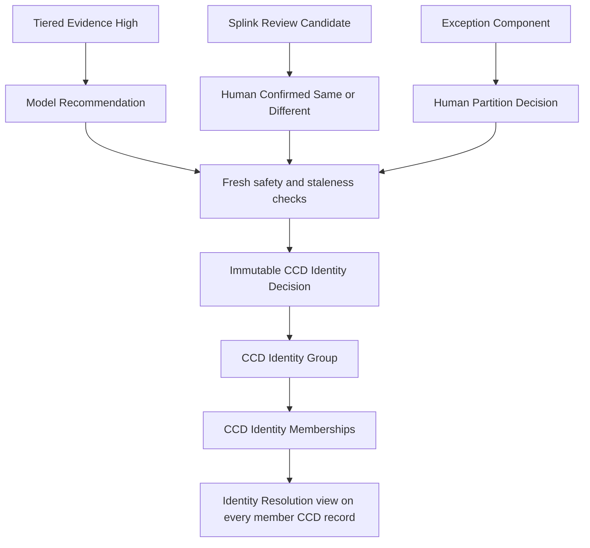

# CCD Identity Resolution Follow-up Workflow Plan

## Document control

| Item | Value |
| --- | --- |
| Status | Implemented and deployed in guarded, default-off mode; live activation not yet authorized |
| Plan date | 2026-08-20 |
| POC policy | `pilot-1.6` |
| Management decision | Limited follow-up workflow approved on 2026-08-19 |
| Approved workflow scope | Tiered Evidence for reversible safety-gated recommendations; Splink above the selected cutoff for optional human-review ordering |
| Explicitly not authorized | Destructive record merging, automatic `Is Matched?`, legacy Matching Score writes, or probabilistic automatic High |

This plan consolidates the decisions made after the POC and remains the design
contract for the implementation. The schema, services, controls, and user
interfaces are now deployed. Materialization remains disabled and no live
identity links, activation batches, holds, review assignments, or QC
investigations have been created. See `IDENTITY_RESOLUTION_IMPLEMENTATION_STATUS.md`
for the verified deployment state.

## 1. Outcome

The follow-up system will resolve identity by linking original `CCD Master`
records into reversible identity groups. It will never need to merge, delete,
or overwrite the source records.

Three independently audited routes may produce identity decisions:

1. an approved Tiered Evidence recommendation;
2. a Splink-prioritized pair finalized as `Human Confirmed Same`; or
3. a finalized exception-component grouping decision.

All three routes use the same safety and identity-materialization service. The
resulting link is the same operational object, while its model/human provenance
remains visible forever.



## 2. Source and environment semantics

The Production, UAT, and Fake/test categories reported in the POC describe
where the testing data came from. They are reporting metadata only.

- Every governed CCD Registration is an equal matching source.
- Production/UAT/Fake labels do not change evidence weights, trust, priority,
  safety gates, or identity membership.
- A pair from two source registrations is treated like a person appearing at
  two centres/systems.
- Multiple rows from one source may be genuine duplicates of the same person,
  but the model must not assume that automatically. Human component review may
  confirm them.
- Headquarters is the integrator; no source receives greater identity authority
  merely because of its environment category.

The environment breakdown remains useful for explaining POC coverage. It must
not be interpreted as a production-versus-UAT identity rule.

## 3. Legacy fields

The existing CCD Master Matching Score table and `Is Matched?` checkbox belong
to the original baseline design. The POC found that the baseline fuzzy score is
not precise enough for the new identity workflow.

They will therefore:

- remain available for backward compatibility and audit;
- be labeled **Legacy Fuzzy Matching** in the UI;
- receive no writes from the new identity-resolution workflow; and
- not determine Identity Group membership.

The new CCD Master **Identity Resolution** tab will be the authoritative view of
reversible identity links.

## 4. Terminology

| Term | Meaning |
| --- | --- |
| Model Recommendation | A Tiered Evidence result proposed by a versioned policy. It is not yet an identity link. |
| Review Candidate | A Splink-ranked pair offered for optional human work. It is never automatic High. |
| Human Confirmed Same | A pair receiving the required independent positive confirmation or adjudication support. |
| Identity Decision | Immutable Same, Different, or partition decision with provenance, evidence version, reviewers and safety outcome. |
| Identity Group | One believed person represented by one or more original CCD Master records. It is not a replacement CCD record. |
| Identity Membership | The reversible relationship between one CCD Master record and one Identity Group. |
| Exception Component | A connected set of High candidate edges that a safety gate refused to resolve automatically. |
| Review Pool | All eligible Splink candidates available for optional review. |
| Review Batch | A non-zero subset deliberately assigned to reviewers. No batch means assigned work is zero. |
| Activation Batch | A frozen set of complete Tiered components selected for one rollout wave. |
| Deliberate Holdout | Complete components temporarily excluded from activation for a later wave or demonstration. A hold is not rejection or reversal. |
| QC Case | A sampled approved recommendation reviewed to monitor model precision and drift. |

## 5. Target data model

### 5.1 `CCD Identity Decision`

An append-only decision record. Recommended fields:

- decision key and version;
- decision type: `Same`, `Different`, or `Partition`;
- origin: `Tiered Evidence`, `Splink Human Review`, or `Component Review`;
- origin document and run;
- policy/model version and snapshot time;
- participating record IDs at permission level 1;
- identity fingerprints for the participating records;
- final groups/partition where applicable;
- reason and safety codes;
- ordinary reviewers, adjudicator and confirmation state;
- decision time and actor;
- superseded/withdrawn reference; and
- immutable creation and lifecycle events.

The decision preserves why a link existed even after the link is ended.

### 5.2 `CCD Identity Group`

Represents a believed person without copying source identity fields.

Recommended fields:

- stable group key;
- current group version;
- status: `Active`, `Needs Revalidation`, or `Ended`;
- originating Identity Decision;
- current group/partition fingerprint;
- active member count;
- creation and last-validation times; and
- superseded/split/merged-group references where needed.

“Merged group” here means combining relationship containers; it never means
physically merging CCD Master documents.

### 5.3 `CCD Identity Membership`

One row per CCD Master record per group membership period.

Recommended fields:

- Identity Group link;
- CCD Master link at permission level 1;
- governed source;
- identity fingerprint at activation;
- status: `Active`, `Needs Revalidation`, or `Ended`;
- valid-from and valid-to timestamps;
- originating Identity Decision;
- ended/superseded reason and actor; and
- immutable lifecycle events.

The service must enforce at most one active Identity Group membership per CCD
Master record. A group may contain multiple records from the same source when a
human decision confirms genuine duplicates.

### 5.4 `CCD Identity Exclusion`

Stores a finalized human `Different` relationship or a cross-group result from
a `Partial Match` decision.

- keyed by ordered record pair and identity fingerprints;
- suppresses the unchanged pair from immediate re-proposal;
- does not suppress a pair forever after identity evidence changes;
- records origin, reviewer/adjudicator and decision time; and
- can be superseded by a newer governed decision.

### 5.5 `CCD Identity Event`

Append-only lifecycle history for Decisions, Groups and Memberships. Events
include create, approve, activate, hold, release, revalidate, end, withdraw,
split and supersede. Demonstration activity must be explicitly marked and must
not be mixed with real correction statistics.

### 5.6 `CCD Identity Activation Batch`

Represents one component-atomic rollout wave.

Recommended fields:

- canary and frozen policy/snapshot references;
- selection method and selection fingerprint;
- batch status: `Draft`, `Reviewed`, `Approved`, `Applying`, `Applied`, or
  `Failed`;
- selected complete component count;
- selected recommendation count;
- planned/created Identity Group and Membership counts;
- stale/new-exception counts;
- dry-run result and aggregate diagnostics;
- approver/application actors and timestamps; and
- idempotency key and error summary.

### 5.7 `CCD Match Review Batch`

Represents optional assigned work from the Splink Review Pool.

- batch size must be greater than zero;
- no batch means zero assigned work;
- stores priority range, filters, assignments, due dates and completion counts;
- may select highest-ranked, source-balanced, risk-targeted, or manually chosen
  unassigned candidates;
- never makes the remaining Review Pool mandatory; and
- becomes stale/superseded when its source queue can no longer be reproduced.

## 6. Shared Identity Resolution view

There is one Identity Group and one Membership per member record. The group is
not copied into each CCD Master document.

Example:

```text
Identity Group G-100
├── Membership M-1 → CCD record A, centre/source A
├── Membership M-2 → CCD record B, centre/source B
└── Membership M-3 → CCD record C, duplicate from source B
```

The CCD A form dynamically shows:

```text
Identity Group: G-100
This membership: M-1
Members: A, B, C
Decision origin and history: ...
```

CCD B and C show the same group and member list, but identify M-2 and M-3 as
their respective memberships. This single-source-of-truth design prevents
copied child tables from disagreeing.

The Identity Resolution tab will show:

- Not Grouped / Resolved Separately / Linked / Needs Revalidation status;
- group and active membership;
- role-protected member list;
- decision origin (`Tiered`, `Human Splink`, or `Component Review`);
- policy/model and snapshot version;
- approval/reviewer context;
- identity evidence fingerprint state;
- group/membership history; and
- manager actions permitted by the current state.

Ordinary reviewers see masked values and aliases. Sensitive Reviewers and
System Managers retain the existing role-gated record links and permitted
values.

`Resolved Separately` means a finalized Different/partition decision has a
current fingerprint-scoped exclusion for this record but no active multi-record
Membership. It is not permanent: governed evidence changes make the old
fingerprint scope non-current, and a later valid active Membership takes display
precedence. `Not Grouped` means neither a current Membership nor a current
Different resolution exists. No display state physically merges CCD Master.

## 7. Recommendation and membership state models

Recommendation status and link status must be separate.

```text
Tiered recommendation
Proposed ──approve/materialize──> Approved
    │                               │
    ├──safety failure────────────> Exception
    ├──withdraw──────────────────> Withdrawn
    └──newer run─────────────────> Superseded
```

A deliberate hold is a rollout flag on a still-Proposed complete component:

```text
Proposed + Available
    │ Hold for later/demo
    ▼
Proposed + Held
    │ Release hold
    ▼
Proposed + Available
```

Identity membership has its own lifecycle:

```text
Active ──identity evidence changed──> Needs Revalidation
   │                                     │
   ├──withdraw/correction──────────────> Ended
   └──new decision─────────────────────> Superseded/Ended
```

Current recommendation status `Active` means status-only approval and has
caused confusion. Because the current canary has zero Active recommendations,
implementation should rename/migrate this concept to `Approved` before any
Identity Membership materialization. Legacy event meanings must remain
readable.

## 8. Shared safety and materialization service

Every route must call one idempotent service. It will process complete identity
components/partitions, not unrelated individual edges.

Before writing a Decision, Group, Membership, or Exclusion it must:

1. require a complete frozen identity fingerprint and frozen source-modified
  value for every governed participant;
2. lock every participating CCD Master and recheck both frozen values inside the
  materialization transaction;
3. fail closed if snapshot metadata is missing, contradictory, or stale;
4. lock the relevant decisions and active memberships;
5. recompute identity fingerprints from governed identity fields;
6. re-evaluate complete valid HKID agreements/conflicts;
7. verify the proposed partition is transitively consistent;
8. verify that a record is not active in a conflicting Identity Group;
9. preserve component atomicity;
10. enforce decision-origin confirmation requirements;
11. calculate an idempotency key; and
12. append complete lifecycle events in the same transaction.

The identity fingerprint must cover identity-relevant fields such as governed
name, complete identifier, birthday, phone and email evidence. A change to an
unrelated administrative note should not invalidate a membership merely because
the CCD Master `modified` timestamp changed.

### Complete HKID conflict

A disagreement between two complete, structurally valid HKIDs remains a hard
governance conflict. An ordinary All Same or Splink Same decision cannot silently
override it. Resolution requires an explicit manager/governance override with
mandatory notes and a separately auditable decision. Partial, masked, invalid,
or missing HKIDs do not receive global-identifier authority.

### Same-source duplicates

Multiple records from one source create a one-to-many safety exception because
the model cannot assume they are duplicates. A properly confirmed `All Same` or
`Partial Match` human decision may place them in one Identity Group. The group
retains a visible same-source-duplicate warning and its human provenance.

## 9. Tiered Evidence workflow

```text
Tiered High candidate
  → cluster/source/HKID/staleness gates
  → Proposed recommendation or Exception
  → optional hold / activation-batch selection
  → dry-run preview
  → batch approval
  → fresh shared safety checks
  → Model-origin Identity Decision
  → active Identity Group memberships
  → asynchronous continuous QC
```

Tiered Evidence remains the only model route currently eligible for automated
recommendation materialization. Splink probability never becomes automatic
High under the current evidence.

Approval is component-atomic. If three recommendation edges form one connected
identity component, a rollout batch must select the whole component or none of
it.

Component-atomic selection defines the **scope of one decision**, not the
partition that a human must choose. An exception-component reviewer must see
and decide every record in `{A, B, C}`, but may still return the complete
partition `({A, B}, {C})`. By contrast, a Proposed Tiered component contains
only safety-gated Same edges and is eligible for one automatic group; selecting
only `A–B` while leaving the connected `B–C` edge outside the batch would leave
one transitive model case partly approved and could make `B` support two
incompatible rollout states.

## 10. Deliberate holdout and bulk approval

A hold temporarily removes a complete Proposed component from rollout
eligibility. It is not rejection, reversal, or a safety exception.

Manager actions:

- **Hold for Later/Demo** — requires reason and records holder/time;
- **Release Hold** — returns the complete component to available Proposed;
- **Preview Approve All** — runs the exact full selector and all safety planning
  without writes;
- **Approve All Eligible** — selects every available Proposed component and
  excludes held components;
- **Approve All Remaining** — after holds are released, selects every remaining
  Proposed component; and
- **Create Activation Batch** — creates a smaller explicit wave.

Example based on the current preview:

```text
Initial Proposed recommendations:  3,528
Deliberate demo holdout:               10
Approve All Eligible:               3,518
Still held:                            10
Release hold:                          10 become Proposed
Approve All Remaining:                 10
Total approved across waves:        3,528
```

Counts are recommendation examples; implementation selects complete components,
so requested edge counts may be adjusted to avoid splitting a component.

### Testing the exact Approve All path

Holdout does not replace full-path testing:

1. automated integration tests create a synthetic canary and approve every
   eligible component;
2. **Preview Approve All** evaluates the exact live 3,528 population with zero
   writes;
3. **Approve All Eligible** exercises the same materializer at live volume while
   excluding the deliberate holdout; and
4. after the demonstration, **Approve All Remaining** processes the released
   holdout through the same service.

All selection modes call the same `apply_activation_batch` service. A retry
must be idempotent and must never create duplicate Decisions, Groups,
Memberships, or events.

Reversing genuine links merely to stage a demonstration is prohibited. It
pollutes correction metrics and creates a misleading audit trail.

## 11. Splink human-review workflow

The current 11,177 candidates remain an optional ranked Review Pool.

```text
No Review Batch
  → assigned work = 0
  → all candidates remain optional
```

When work is desired:

```text
Review Pool
  → create non-zero Review Batch
  → assign selected ranked candidates
  → Same / Different / Unsure
  → confirmation or adjudication
  → final human decision
```

Decision behavior:

- first `Same` → `Positive Confirmation Required`;
- second independent `Same` → `Human Confirmed Same`;
- `Unsure` or disagreement → manager adjudication;
- a positive adjudication still requires independent positive support;
- finalized `Different` creates a fingerprint-scoped Identity Exclusion; and
- stale candidates close and require a new reproducible queue.

A clean `Human Confirmed Same` should not require another redundant ordinary
approval. It calls the shared safety service automatically:

- safe → Human-origin Identity Decision and active Memberships;
- complete-HKID/group/transitive conflict → component/governance exception;
- changed identity fingerprint → stale, with no link created.

The model tier remains `Review` in its source record. The final link records
`Human Confirmed Same`, never model High.

## 12. Optional Review Batches

A Review Batch is an operational tool, not an instruction to review the whole
pool.

```text
Available Review Pool:  11,177
No batch:                    0 assigned
```

or:

```text
Available Review Pool:  11,177
Cycle/Batch 1:              100 assigned
Still unassigned:        11,077
```

The UI must not create a “zero-size batch.” It offers either:

- **Create Review Batch**, with size greater than zero; or
- **Do Not Assign Review Work**, which creates nothing.

Suggested first operational batch is 100 highest-priority unassigned candidates,
with optional source/risk balancing. After completion, management reviews Same
yield, Different rate, disagreement rate, average review time and score-band
value before creating another batch. It may stop permanently; unassigned rows
are not a backlog obligation.

## 13. Exception component workflow

The component form shows all records, the Tiered candidate edges and every
possible pair option. Reviewers decide the complete partition.

### All Same

All component records represent one person. After required confirmation:

- create one Human-origin Identity Decision;
- create or update one Identity Group;
- create one Membership for every record; and
- retain warnings such as multiple records from one source.

### Partial Match

The reviewer explicitly selects Same pairs. The system computes transitive
closure and the resulting groups.

For records R1, R2 and R3:

| Selected Same pairs | Final partition |
| --- | --- |
| R1–R2 | `{R1,R2}`, `{R3}` |
| R1–R3 | `{R1,R3}`, `{R2}` |
| R2–R3 | `{R2,R3}`, `{R1}` |
| R1–R2 and R1–R3 | All three are transitively Same; use All Same |
| No Same pairs | Use All Different |

Each multi-record subgroup becomes an Identity Group or joins a compatible
existing group. Cross-group pairs become fingerprint-scoped Human Different
Exclusions.

### All Different

Every record is a singleton. The system writes Human Different Exclusions for
the relevant component pairs and creates no multi-record Identity Group.

### Unsure

`Unsure` is never final. The component remains unresolved and moves to manager
adjudication. No Identity Decision or Membership is materialized.

### Confirmation and staleness

- two matching independent decisions finalize an ordinary component review;
- Same/Partial positive adjudication requires independent positive support;
- All Different may be manager-adjudicated with mandatory notes under the
  existing governance rule; and
- any identity fingerprint change closes the old component as stale and
  requires a new canary/review.

## 14. Continuous QC with automation

QC monitors an authorized rule; it should not require all 100 current QC cases
to be finalized before every activation wave.

The current stable sample contains 100 Proposed Tiered recommendations. The
target workflow is asynchronous:

- activation may proceed after batch approval and safety checks;
- the 100 cases remain a stable rolling-monitoring cohort;
- a configurable cadence assigns a small number, initially suggested as 10 per
  week;
- every positive QC result uses independent confirmation;
- Unsure/disagreement requires adjudication; and
- the Canary dashboard shows pending, overdue, Same, Different, precision and
  confidence interval.

### Circuit breakers

A confirmed QC `Different` must:

1. end or suspend the affected Memberships;
2. mark the recommendation/decision as a QC failure;
3. pause new automatic materialization for the affected rule/source-pair scope;
4. open a manager investigation; and
5. recompute rolling precision.

After at least 100 finalized comparable QC cases, a Wilson 95% precision lower
bound below 95% pauses the applicable automation scope. Before that rolling
sample is complete, the already approved targeted 100/100 High validation
remains the initial evidence, while any confirmed false positive still triggers
the immediate local circuit breaker.

If QC work exceeds its configured SLA, the system pauses new automated
materialization rather than silently claiming ongoing validation. Existing
memberships remain visible and auditable; they are not automatically erased
solely because reviews are late.

Changed QC records become stale and are replaced by a new deterministic sample
case from the eligible population.

## 15. Change, revalidation, split and reversal

No source record is overwritten. Therefore reversal means ending relationships,
not reconstructing merged data.

### Identity evidence change

1. Detect changed identity fingerprint.
2. Mark affected Membership `Needs Revalidation`.
3. Prevent that stale membership from supporting new automatic decisions.
4. Re-run the applicable safety/materialization logic.
5. Restore Active if still consistent, or end/split/supersede it with events.

### Incorrect member

End only that Membership. Other correct members may remain in their group.

For the narrower case where one finalized two-record Splink candidate was
materialized as Same and both records are later confirmed to be different, the
implemented manager correction is atomic and append-only:

1. Materialization must first be disabled.
2. The live Group must contain exactly the candidate's two current Memberships,
   and the Group, Memberships, and active Same Decision must all originate from
   that candidate. A larger, extended, or changed Group is rejected and must use
   complete-component correction.
3. A System Manager runs a zero-write preview, supplies a mandatory reason,
   types the exact candidate ID, and explicitly marks development/demonstration
   use when applicable.
4. One transaction ends both Memberships and the Group, creates a new
   fingerprint-scoped Different Decision/Exclusion, supersedes the old Same
   Decision, and marks the candidate `Reversed` with actor and timestamp.
5. CCD Master records and original human-review submissions remain unchanged.

The form button is rendered only for a System Manager and the whitelisted
preview/apply APIs repeat that exact role check server-side. Ordinary CCD Match
Reviewers and Sensitive Reviewers cannot invoke the correction by calling the
API directly.

### Incorrect partition

The implemented complete-component correction creates a new versioned
partition, new Groups/Memberships and cross-partition exclusions; ends every
affected current Membership/Group; supersedes affected Decisions/Exclusions;
and preserves all original source decisions, recommendations, reviews and
events. It supports applied Tiered Evidence, Component Review, Splink, and a
prior Governance Override through one System-Manager-only, 2–25-record,
lock-protected transaction. Its zero-write preview freezes the expanded live
scope and its replacement partition before Apply.

### Pending decision overlaps active or pending identity state

An unapplied finalized decision is not corrected because it has not yet created
identity objects. When it touches an existing Group, active Different
exclusion, or another finalized pending source, it enters the unified combined
component workflow instead of an independent retry.

The preview recursively expands through every complete touched active Group,
applicable active-exclusion endpoint, and connected finalized
`Pending`/`Exception` Splink, Component Review, or approved Tiered Activation
Item. Unreviewed candidates and unapproved proposals are shown as adjacent
evidence but are never automatically absorbed. The authoritative scope is
bounded to 2–25 CCD records and 100 finalized source decisions.

A System Manager makes one explicit complete decision: All Same, All Different,
or a Partial Match partition. The exact state may also be Already Represented,
which records an immutable No Change audit without creating relationship
objects. A changed Apply requires Materialization enabled and a clear QC
circuit breaker. It locks records, current identity state, frozen source rows,
and relevant evidence; recomputes the scope fingerprint; then ends/supersedes
the old relationship state and creates one Governance Override replacement in
one transaction. Original CCD Master documents and source evidence are never
merged, edited, or deleted.

### New canary

A newer decision may supersede prior model recommendations. It must not silently
override a finalized human decision; conflicting human provenance returns to
governance review.

## 16. User interface plan

### CCD Master

- new **Identity Resolution** tab;
- clear legacy label for Matching Score and `Is Matched?`;
- current group/membership state;
- shared member list and origin;
- Needs Revalidation warning;
- protected evidence/history; and
- manager withdrawal/revalidation controls.

### CCD Match Canary Run

- Preview Approve All;
- Create Activation Batch;
- Approve All Eligible;
- View/Release Holds;
- Approve All Remaining;
- current group/membership materialization counts;
- QC progress and circuit-breaker state; and
- explicit statement that no physical merge occurs.

### CCD Match Recommendation

- model result separate from rollout/link state;
- component-level hold controls;
- activation-batch link;
- resulting Identity Decision/Group links;
- QC state only when selected; and
- complete audit timeline.

### CCD Match Review Queue

- unassigned Review Pool count;
- Create Review Batch action;
- batch filters/capacity/assignees;
- assigned/unassigned/completed counts; and
- Human Confirmed Same materialization outcome.

### CCD Match Component Review

- existing protected all-record table;
- explicit partition preview before submission;
- warning that All Same includes every record, including same-source duplicates;
- pair selector for Partial Match;
- resulting group/exclusion preview; and
- final Identity Decision/Group links after materialization.

The Component Review list also provides a System Manager bulk action for the
exact checked set of finalized `Pending`/`Exception` components. It previews
without writes and atomically materializes 1–25 complete components per
operation; a failed preflight commits none of the selected set.

The Review Candidate list provides the same bounded workflow for finalized
Splink Same/Different decisions: an exact checked set of 1–25
`Pending`/`Exception` candidates, a zero-write per-candidate preview, rejection
of overlapping CCD participants, and one atomic Apply operation.

Each finalized pending Candidate/Component form also exposes **Preview Combined
Identity Component** to System Managers. Approved Activation Batch rows expose
**Resolve Overlap** only to System Managers. The dialog displays authoritative
included sources separately from adjacent unresolved evidence, current and
suggested partitions, explicit All Same/All Different/Partial controls, and an
audited Already-Represented outcome.

Tiered Preview Approve All lists unsafe components with Recommendation links.
For a component whose only safety failure is structural identity overlap, a
System Manager can prepare a one-component **Overlap Resolution** batch. It uses
the normal reviewed/approved lifecycle but marks the item Exception and blocks
ordinary batch Apply until the combined resolver closes it. No other unsafe or
stale reason is admitted through this route.

## 17. Roles and permissions

| Action | Reviewer | Sensitive Reviewer | System Manager |
| --- | ---: | ---: | ---: |
| View masked relationship context | Yes | Yes | Yes |
| View permitted full values and record links | No | Yes | Yes |
| Submit ordinary QC/candidate/component review | Yes | Yes | Yes |
| Adjudicate | No | No | Yes |
| Create/approve activation batch | No | No | Yes |
| Hold/release rollout component | No | No | Yes |
| Preview/apply combined pending overlap | No | No | Yes |
| End/split/revalidate Identity Group | No | No | Yes |
| View model scores and diagnostics | No | No | Yes |

All permission checks must be server-side. List views, exports, reports and API
responses must preserve the existing masking and permlevel controls.

## 18. Current live starting point

At plan creation:

| Item | Current state |
| --- | ---: |
| Canary status | Ready |
| Proposed Tiered recommendations | 3,528 |
| Exception recommendation edges | 433 |
| Active/status-approved recommendations | 0 |
| Exception components | 191, all Unreviewed |
| Random QC sample | 100, all Unreviewed |
| Splink Review Pool | 11,177, all unreviewed |
| Existing Identity Groups/Memberships | Not implemented |

No implementation migration may infer that the existing `Ready` status is
authorization to create Identity Memberships. Live activation remains a
separate, explicit operation after deployment verification and an approved
activation scope.

## 19. Implementation phases

### Phase 1 — identity foundation

1. Create Identity Decision, Group, Membership, Exclusion and Event DocTypes.
2. Implement server-side permissions and indexes.
3. Add the read-only Identity Resolution tab.
4. Implement identity fingerprints and Needs Revalidation detection.
5. Add no live memberships.

### Phase 2 — materializer and activation batches

1. Implement the shared component/partition materializer.
2. Implement idempotency, locking and transaction boundaries.
3. Add dry-run Preview Approve All.
4. Add component-atomic activation batches and hold/release.
5. Rename/migrate recommendation approval terminology.
6. Keep live application disabled until verification completes.

### Phase 3 — Tiered rollout

1. Connect approved Tiered recommendations to the materializer.
2. Verify source coverage, HKID, transitive and membership conflicts.
3. Create a small Pilot Wave and deliberate demo holdout only after explicit
   authorization.
4. Validate resulting groups from every member record.
5. Enable further controlled waves.

### Phase 4 — human decision materialization

1. Connect finalized Splink Human Confirmed Same decisions.
2. Materialize All Same and Partial Match partitions.
3. Store All Different and cross-partition exclusions.
4. Preserve stale/Unsure cases without links.

### Phase 5 — continuous QC and circuit breakers

1. Add QC dashboard and cadence controls.
2. Implement local pause, membership suspension/end and investigation records.
3. Implement rolling precision/confidence monitoring.
4. Implement overdue-QC pause for new materialization.

### Phase 6 — optional Review Batches

1. Create Review Batch DocType and assignment UI.
2. Select only unassigned reproducible candidates.
3. Add capacity, priority/source/risk filters and due dates.
4. Add cycle outcome metrics and stop/continue decision support.

## 20. Verification and acceptance tests

### Automated unit tests

- identity fingerprint changes only for governed identity evidence;
- complete valid HKID conflicts fail closed;
- masked/partial/invalid HKID is never a global hard identifier;
- one CCD record cannot have two conflicting active memberships;
- same-source duplicate membership requires human provenance;
- component selection is atomic;
- partial-pair selections produce the expected transitive partition;
- hold/release never becomes withdrawal/reversal;
- Review Batch size zero is rejected while no batch remains valid;
- role masking and permlevels are enforced; and
- every lifecycle transition appends the expected event.

### Automated integration tests

- approve-all synthetic canary materializes every eligible component;
- bulk retry is idempotent;
- dry run makes zero writes;
- held components remain Proposed and unlinked;
- release plus Approve All Remaining materializes the remainder;
- both CCD member forms resolve to the same Identity Group;
- withdrawing one Membership leaves valid peers intact;
- identity change moves membership to Needs Revalidation;
- new decisions split/supersede groups without deleting history;
- Human Confirmed Same uses human provenance, not model High;
- All Same handles genuine same-source duplicates;
- All Different creates exclusions but no group;
- partial-match singletons display Resolved Separately while a later active
  Membership takes precedence;
- selected bulk Component Review preview is zero-write, capped at 25, and Apply
  is atomic across the selected set;
- selected bulk Splink preview has the same zero-write, 25-row and atomic-Apply
  guarantees, and rejects overlapping participants;
- combined overlap expansion is transitive across active Groups, active
  Different exclusions, and finalized pending sources without absorbing
  unreviewed Splink evidence;
- combined overlap Apply rejects stale fingerprints, changed frozen source
  metadata, a changed scope, and a tripped QC circuit breaker;
- All Same, All Different, Partial Match, and Already Represented outcomes are
  atomic, bounded, idempotent, and leave CCD Master unchanged;
- stale and Unsure decisions create no membership;
- QC Different invokes the configured circuit breaker; and
- zero Review Batches leaves every Splink candidate unassigned.

### Live read-only verification

- reproduce the 3,528/433/191/100/11,177 starting counts;
- run Preview Approve All against the complete frozen canary;
- confirm planned components are never split;
- confirm no CCD Master, Matching Score or `Is Matched?` mutation;
- confirm no Identity Membership exists before explicit application; and
- verify aggregate output contains no client identity values.

### Live controlled-write verification

Only after separate authorization:

1. take the normal ERPNext backup;
2. apply a synthetic/fake-data activation batch;
3. verify shared group display from all member records;
4. test a demonstration withdrawal only on synthetic/fake data;
5. create the authorized Pilot Wave and holdout;
6. verify audit, idempotency, masking and rollback controls; and
7. stop before any broader wave if a safety or count invariant fails.

## 21. Next management demonstration

Implement and test the full feature set, but do not manufacture reversals on
real links merely to recreate the demo.

Recommended staged state:

- one synthetic/fake-data demonstration component;
- one authorized Pilot Wave of complete components;
- 5–10 complete components held for the meeting;
- all other recommendations still Proposed or in approved waves according to
  the explicit rollout scope; and
- no mandatory Splink Review Batch unless management chooses one.

Demonstrate:

1. Preview Approve All and its zero-write aggregate plan.
2. A held Proposed component and the reason/history.
3. Approval/materialization of a safe demo component.
4. The same Identity Group displayed from both CCD Master member records.
5. A Partial Match partition preview.
6. A Splink candidate becoming Human Confirmed Same only after confirmation.
7. Continuous QC state and a circuit-breaker explanation.
8. A synthetic membership withdrawal showing complete reversible history.

After the meeting, release the deliberate holdout and use **Approve All
Remaining** if management confirms the current frozen activation scope.

## 22. Proposed configurable defaults

These are implementation defaults, not immutable policy:

| Setting | Proposed default |
| --- | ---: |
| Initial Pilot Wave | 100 complete components |
| Demo holdout | 10 complete components, adjusted to component boundaries |
| Existing Tiered QC cohort | 100 recommendations |
| Suggested QC cadence | 10 cases per week |
| Rolling QC window | Latest 100 finalized comparable cases |
| Review Batch | None by default; assigned work 0 |
| First optional Review Batch | 100 candidates if explicitly created |
| Physical CCD document merge | Disabled and out of scope |

Wave size, holdout size, QC SLA and Review Batch capacity remain configurable
management/operations decisions. Their values must be frozen and audited on
each run or batch.

## 23. Completion boundary

This plan is complete when the system can:

- represent one person across multiple unchanged CCD Master records;
- show the same shared group from every member record;
- materialize approved Tiered and finalized human decisions through one safe,
  idempotent service;
- split, end, revalidate and supersede links without destructive merge;
- preserve full decision provenance and audit history;
- automate Tiered links while monitoring them asynchronously through QC;
- leave Splink work entirely unassigned or assign a bounded optional batch;
- approve all, approve controlled waves, and deliberately hold complete
  components without using false reversals; and
- keep legacy Matching Score and `Is Matched?` outside the new workflow.

## 24. Implementation update — 2026-08-20

The planned feature set is implemented and deployed to the `frontend` site in
guarded mode. The deployment added the append-only decision, identity group,
membership, exclusion, event, activation batch, review batch, and QC
investigation models; one shared materialization service; the CCD Master
Identity Resolution view; activation preview/hold/release controls; optional
Splink assignment batches; and asynchronous QC/circuit-breaker controls.

The live boundary was deliberately preserved:

- `materialization_enabled` is `0` and `automation_paused` is `0`;
- every new identity, activation, review-batch, and QC-investigation table has
  zero records;
- all 11,177 Splink candidates remain optional and unassigned;
- no CCD Master record, legacy Matching Score, or `Is Matched?` field was
  mutated; and
- no real activation or demonstration reversal was performed.

The zero-write **Preview Approve All** for frozen canary `p1mucmhogd` selected
3,528 recommendations across 3,520 complete components, planned 3,520 identity
groups and 7,044 memberships, and reported zero unsafe, stale, or conflicting
components. Applying any batch remains impossible until a System Manager makes
the separate, explicit decision to enable materialization.

The component aggregate consists of 3,516 two-record/one-recommendation
components and four three-record/three-recommendation components. The numeric
difference `3,528 - 3,520 = 8` is therefore eight extra pair edges above one
edge per component, not eight omitted CCD records.

## 25. Implementation update — 2026-08-25 overlap governance

The combined pending/active overlap workflow described above is implemented.
It adds `CCD Identity Overlap Resolution`, the manager-only preview/apply APIs,
cross-route recursive scope expansion, explicit partition controls, source and
relationship locks, circuit-breaker enforcement, deterministic no-change
idempotency, source lifecycle updates, audit events, and deployment/migration
coverage. Materialization remains off after deployment; preview and tests do
not authorize or create a new live identity relationship.
