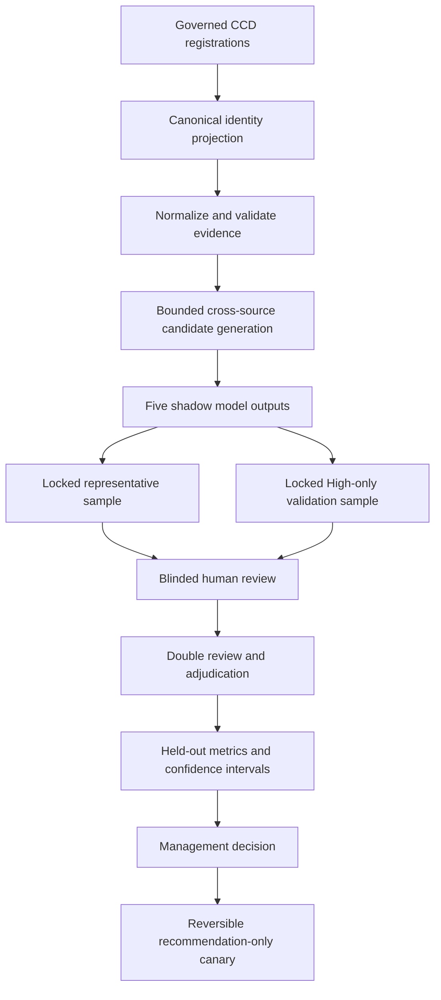
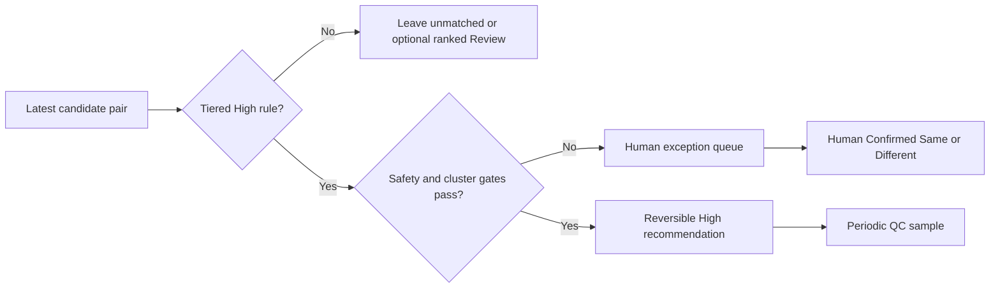

# Cross-Centre Identity Matching Proof of Concept

## Executive decision

**POC status:** Completed. The High Tier Validation evidence was
management-approved for the deterministic High recommendation rule evaluated
from `pilot-1.6`.

The `pilot-1.6` policy document itself remained in `Draft` at the POC date.
Approval of an evaluation run does not promote the policy lifecycle status;
moving it to `Pilot` or `Approved` requires the separate controlled-rollout
decision described below.

The existing fuzzy-score baseline was not accepted as sufficient proof that two
records represent the same person. This POC therefore compared five approaches
in a recommendation-only shadow workflow, locked the evaluated data snapshots,
and used blinded human labels as ground truth.

The approved result is deliberately narrow:

> An exact full Chinese or English name plus exact independent evidence
> (phone, birthday, or email), with no trusted-identifier conflict, may be
> emitted as a reversible High same-person recommendation.

The targeted validation found 100 confirmed Same pairs among 100 uniformly
sampled unseen High predictions. Estimated precision is 100%, with a Wilson
95% confidence interval of 96.30% to 100%. This exceeds the policy target of
95% at the lower confidence bound.

Approval does **not** authorize record merging, automatic `Is Matched?`
updates, or a general probability threshold. Those actions require a separate
controlled rollout and management decision.

## Business problem

`CCD Master` consolidates client records from multiple centres and systems.
The current baseline produces a fuzzy percentage from names and other fields,
but that number has three important limitations:

1. It is a similarity score, not a calibrated probability of identity.
2. Missing evidence can lower a true pair while common names can raise a false
   pair.
3. One threshold cannot express identifier conflicts, independent evidence,
   source scope, or the difference between missing and disagreeing values.

Reviewing every record or every generated candidate pair is also infeasible.
The POC therefore asks a more useful question: can a narrow, measurable High
tier be automated while humans handle only exceptions and quality-control
samples?

## Scope and non-goals

### Included

- Explicitly governed CCD source mappings.
- Cross-source candidate discovery and bounded blocking.
- Five shadow approaches evaluated on identical locked pairs.
- `Same`, `Different`, and `Unsure` human labels.
- Independent double review, positive confirmation, and adjudication.
- Calibration/held-out evaluation and confidence intervals.
- Masking, role separation, stale-record detection, and audit history.
- A reversible High-recommendation rollout design.

### Not included

- Automatic merging or deletion of CCD records.
- Automatic setting of production `Is Matched?` fields.
- Claims that every Review candidate must be processed.
- A validated general Splink High threshold.
- A recall estimate from the High-only validation cohort.
- Empirical validation of an HKID-only High path; no such path was represented
  in the targeted 100-pair sample.

## POC architecture

The shadow evaluator never changes the production matching table or
`Is Matched?`. Raw CCD data remains inside ERPNext; GitHub contains code,
synthetic tests, documentation, and non-identifying aggregate results only.

## Terminology and human decisions

| Term | Meaning |
| --- | --- |
| Model High | A pair met a versioned automatic evidence rule. It remains a reversible pair-level recommendation. |
| Model Review | The evidence is potentially useful but insufficient for automatic identity acceptance. |
| Human Confirmed Same | Independent reviewers/adjudication confirmed identity. This does not rewrite the historical model tier. |
| Human Confirmed Different | Reviewers confirmed that the records should not link. |
| Exception | A High candidate blocked from automatic recommendation by conflicts, clusters, stale data, source scope, or an unvalidated subgroup. |

A reviewer may confirm a model-Review pair as `Same`. Operationally it can
then be handled as a high-confidence **human decision**, but it must remain
distinguishable from a model-generated High prediction for audit and future
measurement.

## The five evaluated approaches

| Method | Purpose | POC conclusion | Automatic use |
| --- | --- | --- | --- |
| Existing baseline formula | Reproduce each registration's current fuzzy logic as the control | Current flagged pairs had low precision; the score is not a probability | No new automatic decisions; retain temporarily as the control/current path |
| Tiered Evidence (gated) | Apply deterministic evidence meaning and block trusted-ID conflicts | Its narrow exact-name-plus-independent-evidence High population passed targeted validation | Approved for a reversible High recommendation canary, subject to safety gates |
| Recoverable-Conflict Tier | Test whether strong secondary evidence can recover a trusted-ID conflict | Useful for moving some conflicts to ordinary Review; it never promotes a conflict directly to High | Human exception routing only |
| Splink probability | Learn local Fellegi-Sunter agreement/disagreement weights | Useful for ranking Review candidates; no probability threshold met automatic High requirements | Ranking, diagnosis, and future recalibration only |
| Hybrid | Apply deterministic safety gates around calibrated Splink scores | Cannot add automatic High decisions without a validated probabilistic High threshold | Shadow/review prioritization only |

The methods have not been discarded. They now have different governed roles:
control, automatic High recommendation, conflict routing, queue ranking, and
future research.

## Evidence and results

### Sanitized data profile

| Measure | POC value |
| --- | ---: |
| CCD Master records in the locked governed snapshot | 251,520 |
| Governed registered sources | 10 |
| Candidate pairs after phone-quality correction | 821,592 |
| Eligible unseen candidate pairs | 820,886 |
| Eligible unseen deterministic High pairs | 3,950 |
| High population in source groups represented by the 100-pair sample | 3,933 (99.57%) |
| Sparse-group High candidates retained as exceptions | 17 |

Three unregistered source labels contained one record each. They were excluded
rather than having field mappings guessed.

### Representative threshold evaluation

- 500 labeled pairs: 98 Same and 402 Different.
- 100 randomized double-review assignments.
- Every observed Same required two distinct human confirmations, resulting in
  190 total double-reviewed pairs.
- 96% raw agreement on the randomized double-review set.
- Cohen's kappa: 0.8339.
- 16 disagreements/Unsure outcomes required adjudication.
- No stale labeled pairs at finalization.

Selected model observations:

| Result | Precision | Recall |
| --- | ---: | ---: |
| Baseline current flag, all labeled | 33.33% | 53.06% |
| Baseline current flag, held-out | 34.72% | 65.79% |
| Tiered Evidence High, all labeled (13 predictions) | 100% | 13.27% |
| Tiered Evidence High, held-out (6 predictions) | 100% | 15.79% |
| Corrected Splink Review threshold, calibration | 44.92% | 88.33% |
| Corrected Splink Review threshold, held-out | 44.62% | 76.32% |

Neither the baseline nor corrected Splink model produced a valid automatic High
threshold meeting 95% precision with the required calibration sample size.

### Targeted deterministic High validation

- Deterministic uniform sample from 3,950 previously unseen High predictions.
- 100/100 pairs received two independent reviews.
- Final labels: 100 Same, 0 Different.
- 98% raw reviewer agreement; two disagreements were adjudicated.
- Precision: 100%.
- Wilson 95% precision interval: 96.30% to 100%.
- Recall was not estimated because every sampled pair was model-predicted High.
- Management decision: Approved as validation evidence.

The near-zero kappa in this High-only cohort is a prevalence artifact: almost
every ordinary label was `Same`, and the two `Different` labels occurred on
opposite disagreement pairs. Raw agreement and adjudicated precision are more
informative for this deliberately enriched cohort.

## Important quality findings during the POC

The POC tested the surrounding workflow as well as the matching rules. It found
and corrected several issues before approval:

1. Partial, masked, or check-digit-invalid HKIDs cannot become trusted global
   identifiers. Only complete valid HKIDs may use the governed global scope.
2. An obvious sequential phone placeholder shared by many records created an
   oversized block. Malformed, non-eight-digit, and full sequential phone
   values are now missing evidence rather than exact identity evidence.
3. Splink originally received missing values as empty strings and learned
   missing/missing pairs as exact agreements. Missing comparison fields are now
   SQL nulls. The repaired High-run probabilities range from 0.998864 to 1.0.
4. Randomized reviewer-agreement assignments are preserved separately from
   outcome-triggered positive confirmations, preventing biased kappa metrics.
5. Previous human-used pairs are excluded from later validation cohorts.

The corrected 500-pair Splink evaluation still produced no valid automatic
High threshold, so its previous rejection remained unchanged.

## Safety and governance controls

| Risk | Control |
| --- | --- |
| Common or similar names | Names alone never create automatic High |
| Shared family phone/email | High still requires an exact full name; cluster/one-to-many gates remain mandatory |
| Partial or masked HKID | Never trusted as global identifier evidence |
| Conflicting trusted identifiers | Gated to human Conflict Review |
| Dummy or malformed phone data | Removed during normalization before blocking/scoring |
| New or changed source mapping | Explicit versioned source profile; no inferred mappings |
| Record changes after sampling | Snapshot timestamps and stale-pair exclusion |
| Reviewer anchoring | Ordinary reviewers do not see model scores/reason codes |
| One reviewer confirming a positive | Every Same requires two distinct people |
| Transitive cluster contradiction | Full cluster safety check before recommendation rollout |
| Irreversible production action | POC is shadow-only; next phase stores reversible recommendations |
| Client-data leakage | Local computation, masked identifiers, no raw data in GitHub |

## POC acceptance criteria

| Criterion | Result |
| --- | --- |
| Run on locally governed multi-source CCD data | Passed |
| No production match-table or `Is Matched?` mutation | Passed |
| Complete representative human label set | Passed |
| Independent double review and adjudication | Passed |
| Deterministic High precision lower confidence bound at least 95% | Passed: 96.30% |
| No truncation or oversized block in corrected High run | Passed |
| Valid general probabilistic High threshold | Not met; Splink remains review-ranking only |
| Management approval of deterministic High evidence | Passed |
| Production automation approval | Not part of this POC |

## Recommended operating model

The system must not create a 250,000-record manual-review project. After a
separate rollout authorization:

1. Recompute `pilot-1.6` on the latest data.
2. Emit passing pairs as reversible model-High recommendations.
3. Apply trusted-ID conflict, one-to-many, transitive-cluster, stale-record,
   source-coverage, and data-quality gates.
4. Retain safe High recommendations automatically.
5. Route only exceptions and a periodic random QC sample to humans.
6. Use Splink to rank optional/on-demand Review work; do not make the whole
   Review population a mandatory backlog.
7. Store human-confirmed Review pairs separately from model High predictions.

## Next-phase rollout proposal

### Phase 1: recommendation-only engineering

- Create a versioned recommendation record with model version, evidence reason,
  snapshot time, source scope, status, and reversal history.
- Generate safe High recommendations without modifying existing match flags.
- Keep the 17 sparse-group candidates and all safety failures as exceptions.
- Produce aggregate counts and conflict/cluster reports before release.

### Phase 2: controlled canary

- Start with the source groups represented in validation.
- Compare recommendations against subsequent human/operational outcomes.
- Review a small random sample of new High predictions for drift.
- Stop automatically if precision, stale rate, or conflict rate breaches its
  approved limit.

### Phase 3: separate production decision

Management chooses one explicit action:

1. display recommendations only;
2. populate the existing Matching Score table; or
3. set `Is Matched?` automatically.

The POC recommends starting with option 1 or 2. Record merging and automatic
`Is Matched?` remain out of scope until the canary has been reviewed.

## Limitations

- High validation estimates conditional precision, not candidate-generation
  recall or total duplicate prevalence.
- A 100/100 result does not guarantee zero future errors; the 95% lower bound
  is 96.30%.
- Three sparse source-pair groups representing 17 High candidates were not
  selected by the uniform sample and remain exception-only.
- New centres, mapping changes, and data drift require monitoring and may need
  fresh validation.
- Pair-level High edges cannot be treated as a person cluster until transitive
  consistency and one-to-many conflicts are checked.
- The Splink model remains optional and unsuitable for automatic High decisions
  until a future labeled cohort validates a probability threshold.

## Decision boundary

This POC proves that a narrow deterministic High recommendation tier is viable
on the evaluated governed data. It does not prove that all fuzzy candidates
should be matched, that every possible duplicate is discoverable, or that a
probabilistic score can replace governance and human exception handling.

The next requested authorization should therefore be:

> Build and demonstrate a reversible recommendation-only canary for the
> approved deterministic High rule, with exception-only human review and no
> production merge or `Is Matched?` mutation.
